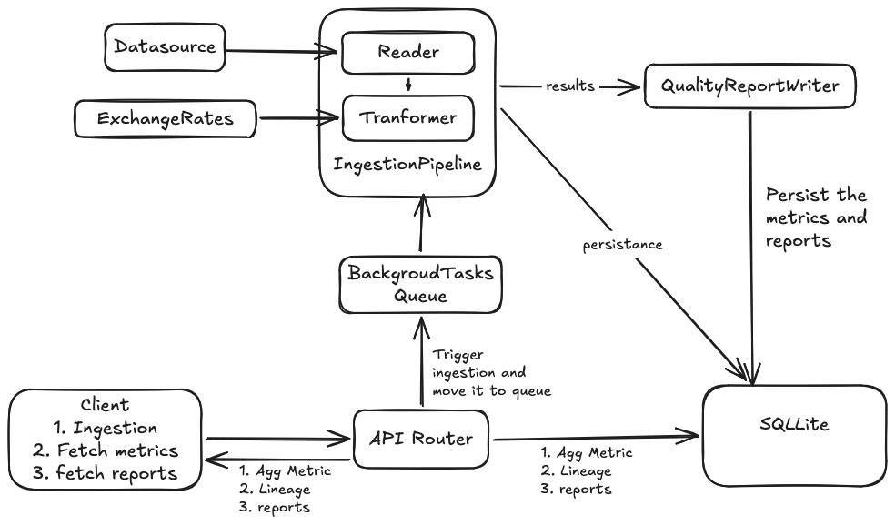

# Campaign Hub Architectural design

Campaign hub is the collection point of various disparate data sources.
These data sources for the purposes of this assignement were csv and 
json files. They contain information related to various marketing metrics.

A campaign manager will engage with multiple platforms for marketting
purposes. Data generated by these platforms is semantically similar but 
the generated reports can have disparate data shape and labels. 

Goal of this project is to provide a simple way to integrate, and analyse
new sources of data with minimal code changes. 

## Objectives
1. Ingestion pipeline to provide a clean interface for integrating datasource.
2. Provide a schema driven transformer for converting datasources to a consistent shape
3. Collect errors on schema transformations and use to generate reports.
4. Track lineage of the aggregations and map transformations to delivery results.
5. API to access the aggregations of the ingested data based on campaign.
6. UI to show aggregations, health reports, lineage and ingest data.

## Architecture

### Diagram


### Reader
This is the entry point for data to the ingestion pipeline. The module 
`src.ingestion.Reader` defines the interface for the Reader.

```python
class AbstractReader(ABC):
    @abstractmethod
    def read(self) -> Generator[Any, None, None]:
        pass
```

The read method return chunks of the datasource based on the defined 
conditions. We have defined a concerte class called Reader that takes
in a file and returns chunks of csv or json based on filetypes.(Note: 
It can be split into a CSVFileReader and JSONFileReader and FileReader 
to improve the separation of concerns).

We are using standard python libraries to process the csv and json. 

### Transformers
After a chunk is returned by the Reader it needs to be processed into the 
standard datamodel. We have defined a standard interface for this.

```python
class BaseTransformer(ABC):
    """Abstract base class for chunk-to-CampaignMetric transformers."""

    @abstractmethod
    def transform(self, chunk: Any) -> CampaignMetric:
        """Transforms a single record chunk into a validated CampaignMetric."""
        pass
```

In addition a transformer also admits a schema that defined the mapping from source 
row to target. For the provided data files the schema is defined as presets in the 
`frontend/src/components/IngestModal.tsx`. Someone can define a custom schema to 
map a new file to the model as well. 

The transformer takes in chunks at a time. So failures don't cause loss of data.

### Pipeline
`IngestionPipeline` takes reader and transformer as arguments and processes
them into the metric rows. This returns a `TransformationResult` that contains
the successfully processed rows and the the errors.

### Report Writer
`QualityReportWriter` uses the tranformation result and generates a quality report
based on the results. The report writer checks if file is complete and readable, 
validity of rows, and checks for duplicates. The report writer generates warnings
and assigns a quality.
1. FILE Check -> Pass if any records can be read
2. ROW check -> Pass(error-rate=0) < Warning (error-rate < 5%) < Faieled
3. Duplication check -> Pass (duplicate count == 0) < Warning(duplicate count > 0 )  

Overall Quality 
1. Critical -> If any of the above checked failed
2. Degraded -> If any of the above checks resulted in a warning
3. Healthy -> All pass

## REST API Specifications

The ingestion platform exposes a set of REST endpoints for asynchronous data ingestion, aggregated metrics retrieval, data quality auditing, and metric lineage traceability.

---

### Ingestion API

#### `POST /api/v1/ingest`

Queues an asynchronous file ingestion job via FastAPI `BackgroundTasks`.

* **Status Code:** `202 Accepted`
* **Request Body:** `IngestionRequest` (JSON)
* `delivery_id` (str): Unique ingestion identifier.
* `filepath` (str): Path to target raw payload file.
* `file_format` (str): Format type (`csv`, `json`, `xml`).
* `config` (dict, optional): Custom field extraction and transformation mappings.


* **Behavior:** Applies default preset transformation rules if no `config` is provided, enqueues `run_ingestion_task`, and immediately returns execution status.

---

### Campaign Metrics APIs

#### `GET /api/v1/metrics`

Fetches unaggregated, row-level campaign metric records with optional filtering.

* **Query Parameters:**
* `platform` (str, optional): Filter by platform name (e.g., `Meta`, `Google`).
* `start_date` (date, optional): ISO date lower bound (`YYYY-MM-DD`).
* `end_date` (date, optional): ISO date upper bound (`YYYY-MM-DD`).


* **Response:** Array of metric objects (`platform`, `campaign`, `date`, `spend_usd`, `impressions`, `clicks`).

#### `GET /api/v1/metrics/aggregated`

Computes grouped aggregations and derived performance indicators (CTR, CPC).

* **Query Parameters:**
* `group_by` (str, required): Aggregation key—must be `campaign` or `platform`.
* `platform`, `start_date`, `end_date` (optional filters).


* **Response Schema:**
```json
[
  {
    "campaign": "Summer_Sale",
    "group_key": "Summer_Sale",
    "total_spend_usd": 1250.50,
    "total_impressions": 50000,
    "total_clicks": 1200,
    "ctr": 0.0240,
    "cpc": 1.04
  }
]

```


---

### Data Health & Lineage APIs (NFR-3 Traceability)

#### `GET /api/v1/deliveries`

Lists all processed delivery jobs along with high-level processing metrics.

* **Response:** Array of delivery records including `delivery_id`, `filename`, `processed_at`, `health_status`, `total_records`, and `error_records`.

#### `GET /api/v1/deliveries/{delivery_id}/report`

Retrieves the detailed validation and error report for a specific delivery payload.

* **Path Parameter:** `delivery_id` (str)
* **Error Response:** `404 Not Found` if the delivery ID is invalid.

#### `GET /api/v1/source_list`

Scans `DELIVERIES_DIR` and returns metadata for discovered source payload files.

* **Response Schema:**
```json
{
  "sources": [
    {
      "filename": "meta_2026_q1.csv",
      "filepath": "data/deliveries/meta_2026_q1.csv",
      "format": "csv",
      "size_bytes": 1048576
    }
  ]
}

```


#### `GET /api/v1/metrics/lineage`

Audits data lineage by mapping aggregated metrics back to their originating delivery payloads and applied transformation rules.

* **Query Parameters:** Optional filters (`campaign`, `platform`, `start_date`, `end_date`).
* **Response:** Joined breakdown containing `delivery_id`, `filename`, `contributing_rows`, `contributed_spend`, `contributed_impressions`, `contributed_clicks`, and the complete `applied_config_json` schema rules.

---

### System Health

#### `GET /health`

Liveness probe endpoint. Returns `{"status": "ok"}`.

## Out of scope 
This system is a version of the key requirements as mentioned in 
ASSIGNMENT_INSTRUCTIONS.md. Following are the key simplifications were made 
in interst of time and brevity. 

### Tranformation functions
We are using predefined functions for parsing currencies and time that are
only relevant to the files provided. See the `src/transformers/campaign_transformer`
```python
TRANSFORM_FUNCTIONS = {
    "parse_us_date": parse_us_date,
    "parse_currency": parse_currency,
    "parse_micros": parse_micros,
    "parse_epoch_ms": parse_epoch_ms,
    "parse_nested_spend": parse_nested_spend,
    "float": float,
    "int": int,
}
```
This also means that if a new schema needs a new function a new function 
would need to be defined. This a major limitation. Integrating functions 
to a schema is tricky as it creates lots of vulnerablities.

### Datasouce Integration
Currently only files are ingested as a datasource. This is done through 
`src.ingestion.Reader.Reader`. It takes in a file and returns chunks of 
file for processing. This functionality can be made more robust and 
modified to handle things like databses, caches, queues, etc. The interface
is defined, and the transformers will only care about the interface.

### Live Deployment
Skipped due to time constraints. Only local deployment is available.


## AI use
All the key architectural decisions were made by myself. AI was used to generate
the code based on interfaces provided. AI was also used to generate the 
descriptions of the API section of this document. AI was used to write the 
unit test cases.

**AI wasn't used to come up with design of the ingestion pipeline**. The key 
features are based on my experience of working on Tableau and DataCloud at 
salesforce.

